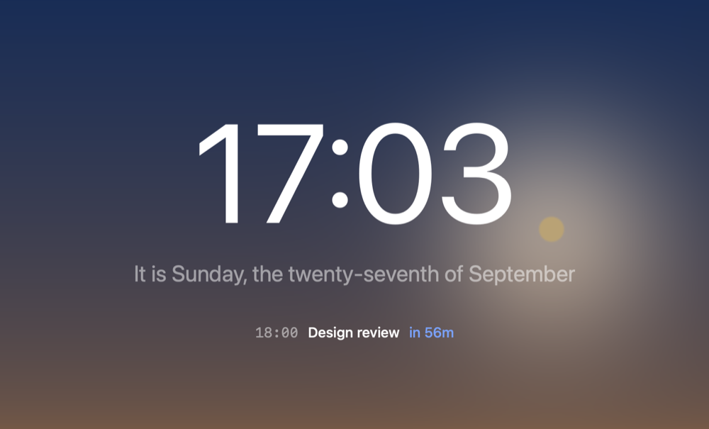
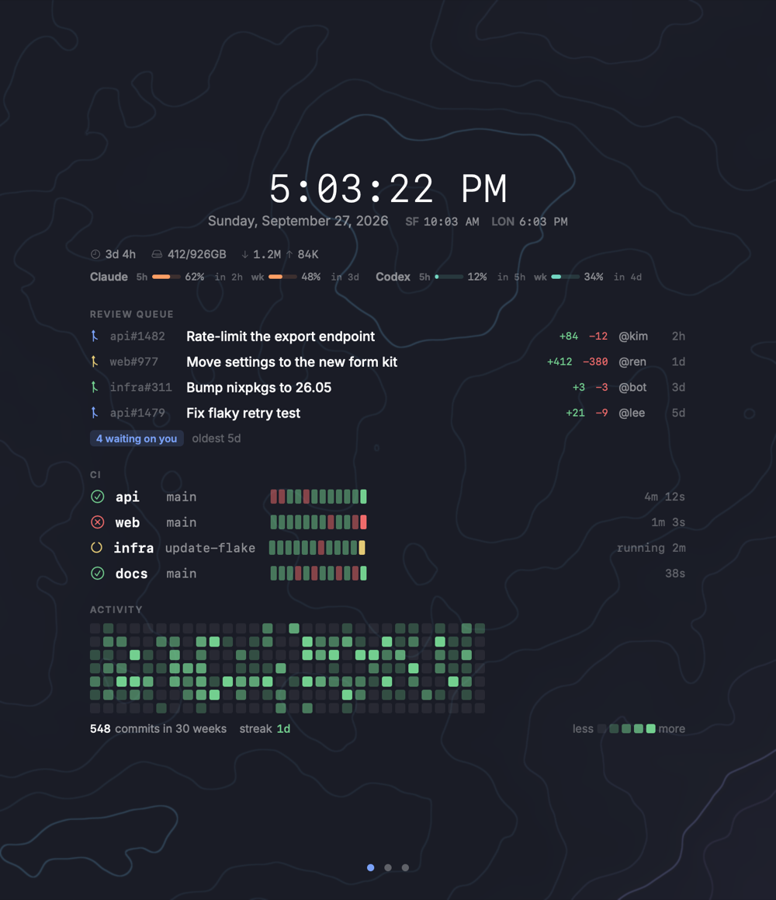
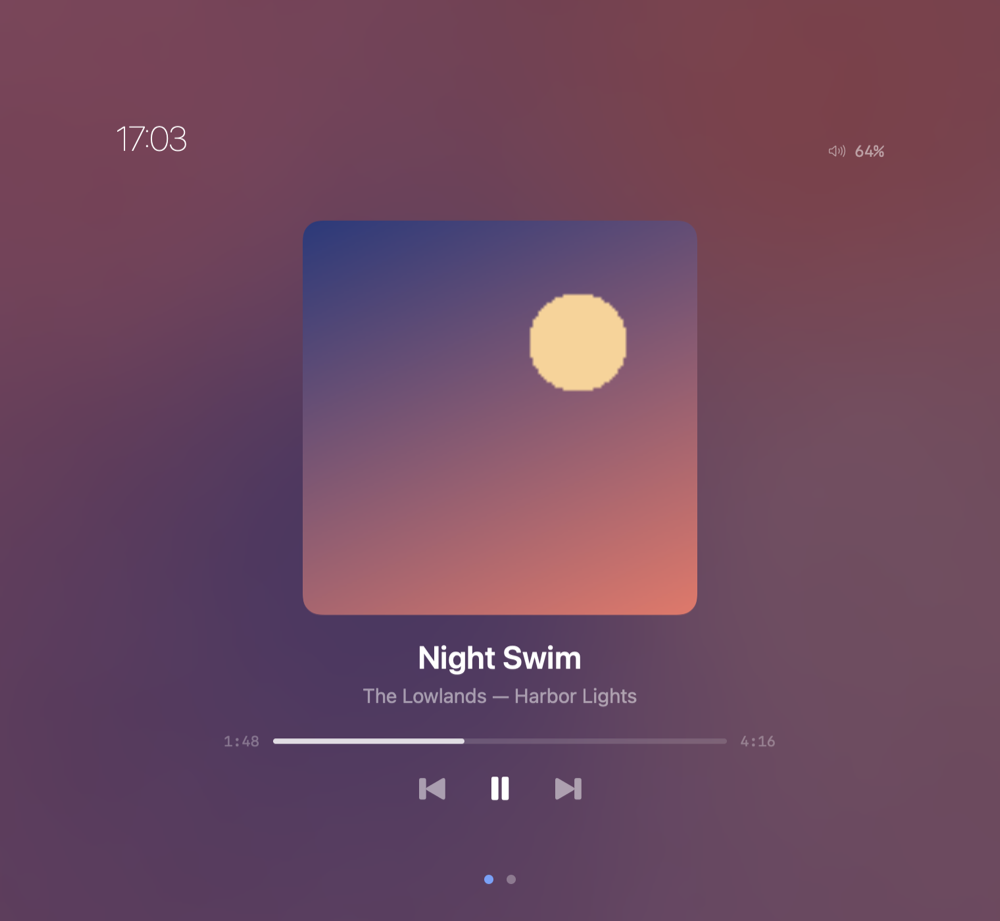
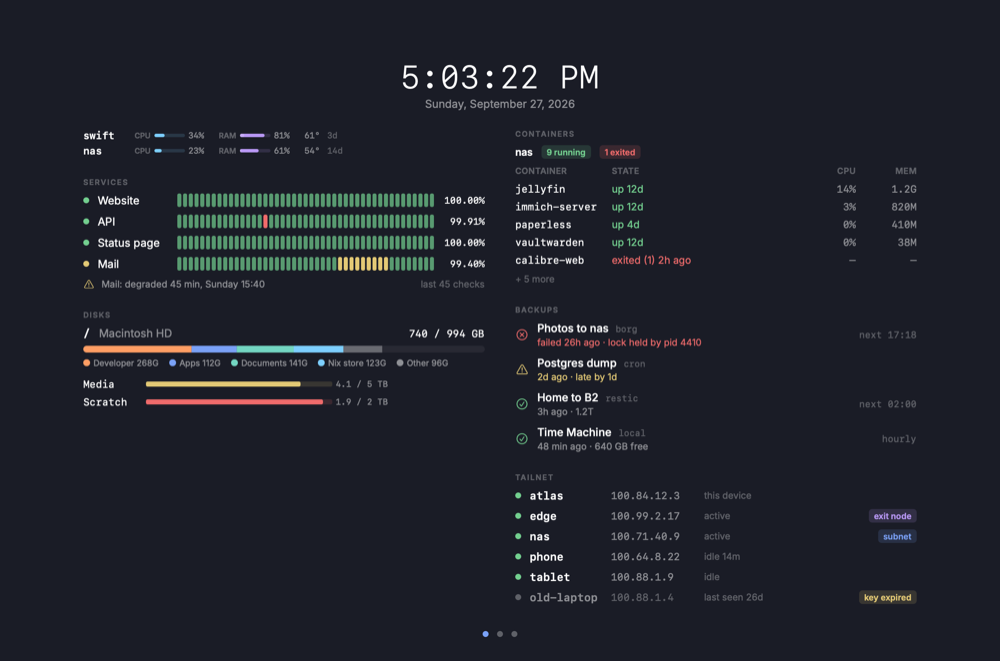
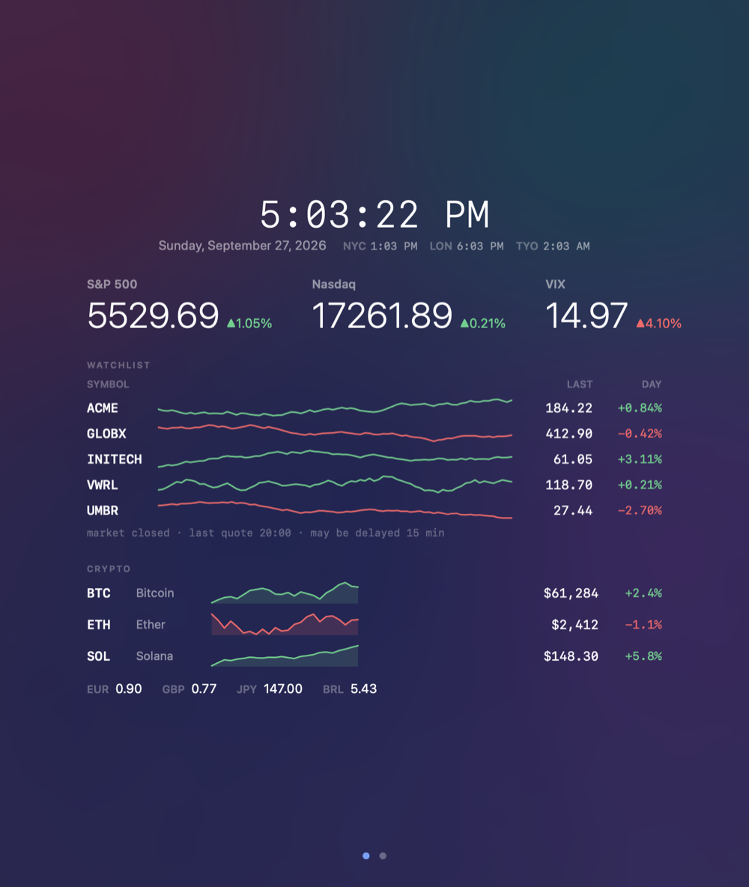
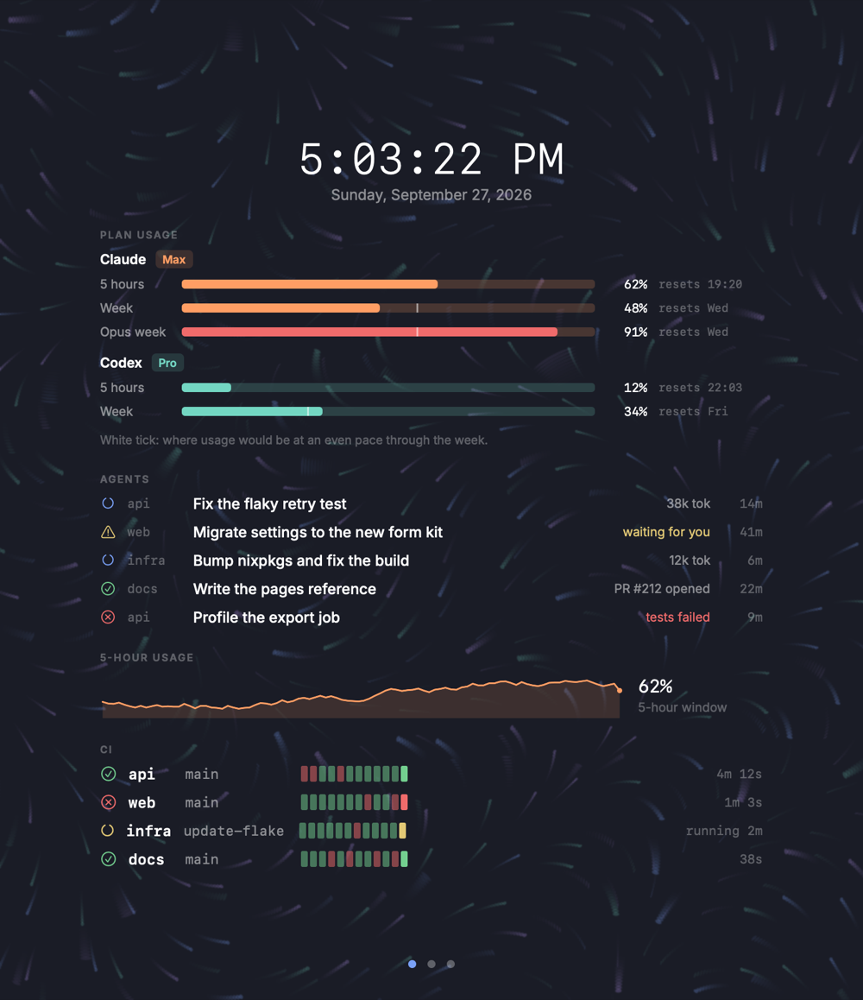

# vestal

A full-screen dashboard on one key. Press it, glance, press it again. One config draws it on macOS and Linux, and your agent writes the config.

Site: <https://vestal.matv.io> · [Docs](https://vestal.matv.io/docs/) · [llms.txt](https://vestal.matv.io/llms.txt)


## What it is

Press a key and vestal covers the screen with what matters: the time, your agenda, your machines, reviews, builds, markets, music. Press it again and it is gone. While hidden it stays resident and uses almost nothing.

- **One config.** A single JSON file, `~/.config/vestal/config.json`, drives the SwiftUI app on macOS and the GTK 4 app on Linux.
- **Your agent builds it.** Everything an agent needs ships in the binary, runs without a screen and answers in JSON, so it can write the config, check it and look at the result.
- **About 50 widgets.** Clocks, agenda, system health, media, weather, pull requests, CI, containers, markets, habits and more, each with sample data you can render without a live source.
- **8 starters.** Pick one on the first run, then reshape it.
- **Backgrounds, clock faces and typefaces.** Shader backgrounds (aurora, mesh, sky, stars, rain and others), drawn clock faces and a set of bundled typefaces.

### Starters

<table>
<tr>
<td align="center"><br><b>minimal</b></td>
<td align="center"><br><b>developer</b></td>
<td align="center"><br><b>media</b></td>
</tr>
<tr>
<td align="center"><br><b>homelab</b></td>
<td align="center"><br><b>markets</b></td>
<td align="center"><br><b>agentops</b></td>
</tr>
</table>

The other two are `default` (the hero above) and `focus`. `vestal docs starters` describes all eight. The images are drawn from sample data (`scripts/readme-images.sh`).

## Install

### macOS (14 or later, Apple silicon and Intel)

Homebrew:

```sh
brew install --cask syntheit/vestal/vestal
```

Or download `Vestal-<version>.dmg` from [GitHub Releases](https://github.com/syntheit/vestal/releases), open it and drag `Vestal.app` onto Applications. The app is signed and notarized.

### Nix (macOS or Linux)

```nix
# flake.nix
inputs.vestal.url = "github:syntheit/vestal";

# Home Manager
{
  imports = [ inputs.vestal.homeManagerModules.default ];

  programs.vestal = {
    enable = true;
    starter = "developer";            # optional; any starter id
    settings = {                      # merged over the starter
      hotkey = "cmd+shift+space";
    };
  };
}
```

`programs.vestal.settings` becomes `~/.config/vestal/config.json`. Every option is in [nix/hm-module.nix](./nix/hm-module.nix). See [docs/reference/install.md](./docs/reference/install.md) for login items and more.

### Linux

Install through Nix as above. The renderer is GTK 4 with layer-shell, so a compositor that supports it (Hyprland, sway and similar) is required. Wayland has no global hotkeys: bind `vestal toggle` in the compositor (`programs.vestal.hyprland.enable` does it for Hyprland).

## First run

```sh
vestal init --starter default    # writes ~/.config/vestal/config.json; --list shows the eight
```

Then press `cmd+shift+space` (every starter sets it) to show the dashboard, and again to hide it.

macOS asks for two permissions, each the first time something needs it:

- **Calendar**: when the agenda reads your calendars. Allow Full Access; vestal only reads events.
- **Automation**: when the media widget talks to Music, Spotify or another player.

Nothing else needs a permission.

## Configure

**By hand.** [Your first dashboard by hand](./docs/guide/first-dashboard.md) takes about fifteen minutes. [Config syntax in 10 minutes](./docs/guide/config-syntax.md) is the grammar. [docs/CONFIG.md](./docs/CONFIG.md) lists every key.

**With an agent.** Point it at [AGENTS.md](./AGENTS.md) (the same text as `vestal docs agents`) and ask for what you want. The loop is: discover, write, `vestal check-config`, `vestal render`, look at a `vestal screenshot`, `vestal reload`. Agents on the web can read [`llms.txt`](https://vestal.matv.io/llms.txt) on the project site.

## Widgets

Clock and date, system bar, media, agenda, system health, weather, AI plan usage, pull requests, CI, containers, tailnet, backups, headlines, crypto and watchlists, focus timer, habits and many more. Every one, drawn at its real size with the line that adds it, is on [the site](https://vestal.matv.io/#widgets). `vestal gallery` renders them all locally.

## Command line

```sh
vestal toggle                          # show or hide (starts vestal if needed)
vestal show / vestal hide              # show or hide explicitly
vestal reload                          # re-read the config
vestal status                          # sources, warnings, errors
vestal check-config [file]             # validate a config
vestal render --config file.json       # the resolved dashboard as text or JSON
vestal screenshot out.png              # draw the dashboard offscreen to a PNG
vestal init --starter <id>             # write a starter config
vestal gallery --out dir               # draw every widget sample to PNGs
vestal docs [topic]                    # the built-in documentation
```

`vestal help` lists the rest; [docs/reference/cli.md](./docs/reference/cli.md) has every option and exit code.

## Privacy

No telemetry, no analytics, no account. Vestal talks to the network only for the sources you configure, such as a weather or rates URL, a GitHub or CI API, or hosts you list. Delete a source and nothing contacts it.

## Build

```sh
nix build        # or: swift build -c release
nix flake check
```

macOS 14+ and Swift 5.10.

## License

[GPL-3.0](./LICENSE)
