<h1 align="center">vestal</h1>

<p align="center">
A full-screen dashboard on one key. Press it, glance, press it again.<br>
One config draws it on macOS and Linux, and your agent writes the config.
</p>

<p align="center">
<a href="https://vestal.matv.io"></a>
<a href="https://vestal.matv.io/docs/"></a>
<a href="#install"></a>


<a href="./LICENSE"></a>
</p>

<p align="center"></p>

## Press a key. Glance. Press again.

- **One config.** `~/.config/vestal/config.json` drives the SwiftUI app on macOS and the GTK 4 app on Linux.
- **Your agent builds it.** Docs, schema, validation and offscreen screenshots ship in the binary, so an agent can write the config and look at the result.
- **About 50 widgets, 8 starters.** Pick a starter on the first run, then reshape it.

## Starters

<table>
<tr>
<td align="center" width="25%">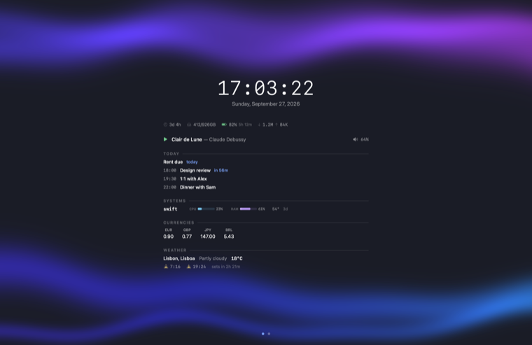<br><b>default</b></td>
<td align="center" width="25%">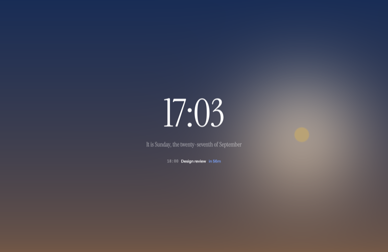<br><b>minimal</b></td>
<td align="center" width="25%">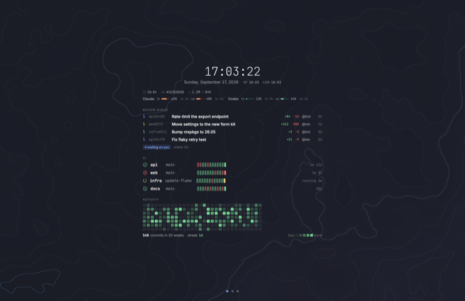<br><b>developer</b></td>
<td align="center" width="25%">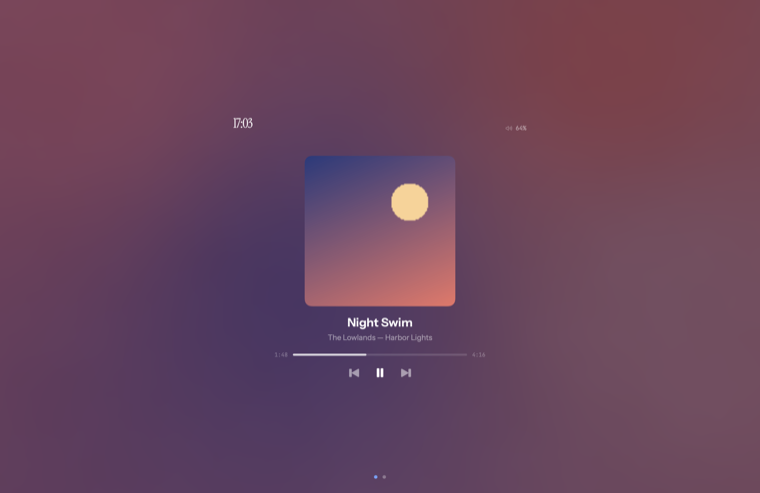<br><b>media</b></td>
</tr>
<tr>
<td align="center" width="25%">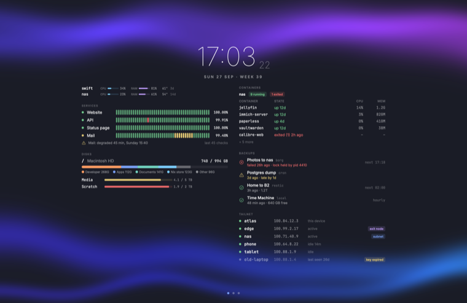<br><b>homelab</b></td>
<td align="center" width="25%">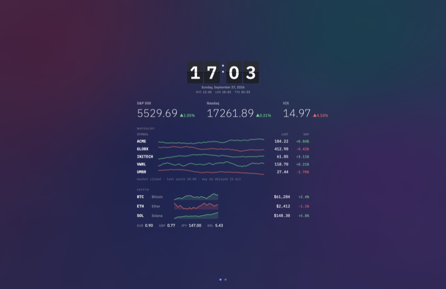<br><b>markets</b></td>
<td align="center" width="25%">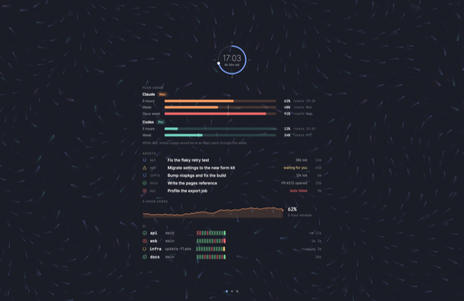<br><b>agentops</b></td>
<td align="center" width="25%">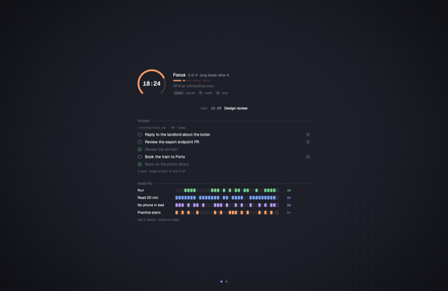<br><b>focus</b></td>
</tr>
</table>

## Clock faces

<p align="center">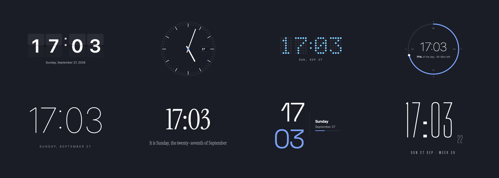</p>

<p align="center">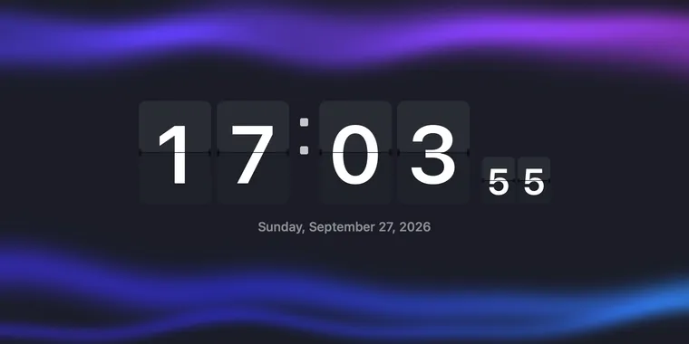</p>

## Backgrounds

<p align="center">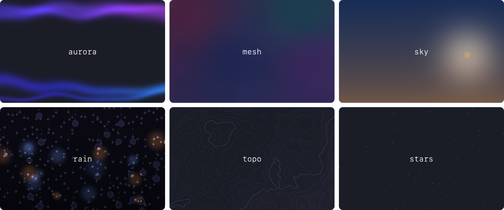</p>

## Widgets

<p align="center">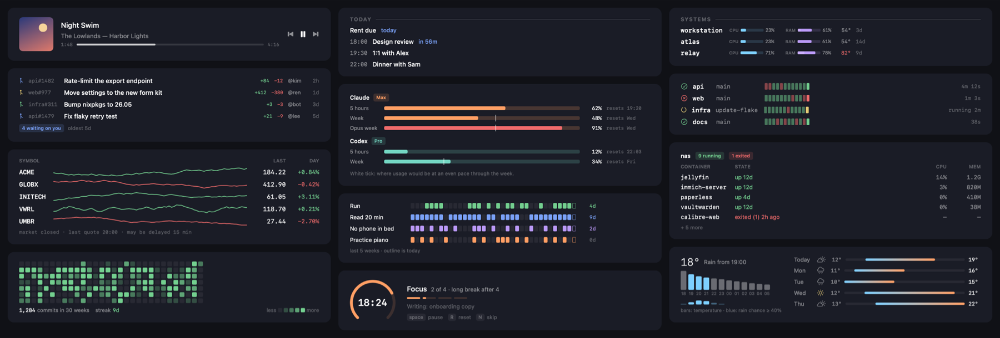</p>

Every widget, at its real size with the line that adds it, is on [the site](https://vestal.matv.io/#widgets).

## Install

```sh
brew install --cask syntheit/vestal/vestal
vestal init            # writes ~/.config/vestal/config.json (vestal init --list shows the starters)
# then press cmd+shift+space to show it, and again to hide it
```

- **DMG:** download `Vestal-<version>.dmg` from [Releases](https://github.com/syntheit/vestal/releases/latest) and drag `Vestal.app` onto Applications.
- **Nix (macOS or Linux):** the flake has a Home Manager module, `programs.vestal`; see [install](https://vestal.matv.io/docs/install.html).

## More

[AGENTS.md](./AGENTS.md) (point your agent here) · [Docs](https://vestal.matv.io/docs/) · [llms.txt](https://vestal.matv.io/llms.txt) · [Changelog](./CHANGELOG.md) · [License: GPL-3.0](./LICENSE)
